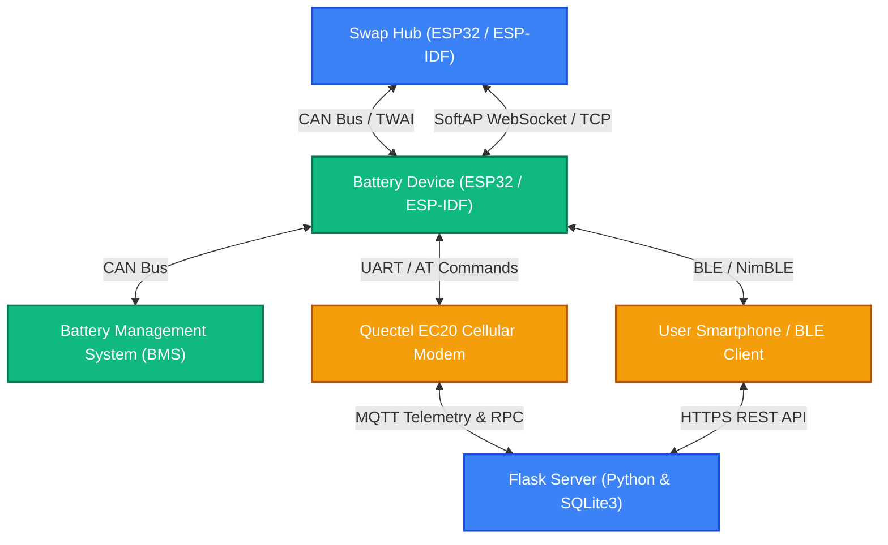

# LiBMAT Firmware: System Architecture & Git Branch Analysis

This document provides a comprehensive, structured analysis of the source code in the **LiBMAT Firmware** repository. It outlines the core system design, directory structure, communication channels, database schemas, and the purpose/divergence of all local and remote Git branches.

---

## 1. System Architecture Overview

The **LiBMAT** (Lithium Battery Management and Tracking) system is an IoT-enabled battery swap station ecosystem. It allows smart battery packs to interface with modular slot-based locking hubs (**Swap Hubs**). The system utilizes ESP32 microcontrollers, cellular connectivity (Quectel EC20), CAN bus (Espressif Two-Wire Automotive Interface - TWAI), Bluetooth Low Energy (BLE), and local displays/sensors to run an automated battery swap infrastructure.

### Communication & Data Topology



---

## 2. Source Code Organization

The codebase is organized into three main directories:

### 📁 `ArduinoBase/`
Legacy or reference implementation files written in the Arduino Core framework for ESP32 (specifically LilyGO TTGO T-Call boards with SIM800/SIM7000 modems).
- **Core Functionality**: Configures power management units (AXP192 PMU), reads MPU6050 accelerometer, reads GPS coordinates, and publishes vehicle/battery telemetry to a ThingsBoard server over a cellular GPRS link.
- **Key Modules**:
  - `TTGO_Main.ino`: Integrates PMU, accelerometer, GPS, GSM, and ThingsBoard.
  - `TTGO_BSerial_Main.ino`: Investigates software/hardware serial performance.
  - `TTGO_Protobuf_Test/`: Verifies Protobuf serialization for packet size optimization.

### 📁 `IDFBase/`
The main active firmware suite built on the **Espressif IoT Development Framework (ESP-IDF)** in C++. It contains driver proof-of-concepts (PoCs) and the core project firmware.
- **Core Firmware (`IDFBase/IDF_PoC/`)**:
  - **`PoC_Battery`**: Designed to sit inside individual battery enclosures. Includes a CAN controller task to query BMS telemetry, a BLE advertising task (NimBLE) for user phones, a WebSocket client, and UART interfaces to cellular modems.
  - **`PoC_Hub`**: Controls the multi-slot physical charging and lock cabinet. Configures a Wi-Fi Access Point (SoftAP), hosts a WebSocket/HTTP server, handles slot-open logic, and monitors door microswitches.
- **Driver PoCs**:
  - `IDF_CANBUS/`, `IDF_UART_Test/`, `IDF_I2C_Test/`, `WiFi_Test/`, `PPPOS_Test/`: Target driver evaluations for basic hardware validation.

### 📁 `Server/`
A lightweight local management server written in Flask (Python 3) backing onto SQLite3.
- **Core Functionality**: Acts as a register and swap coordination endpoint. Allows devices to query customer assignment profiles and authorizes swaps.
- **Database Schema (`schema.sql`)**:
  ```sql
  CREATE TABLE customersData (
      id INTEGER PRIMARY KEY AUTOINCREMENT,
      email TEXT NOT NULL UNIQUE,
      password TEXT NOT NULL,
      created TIMESTAMP NOT NULL DEFAULT CURRENT_TIMESTAMP
  );

  CREATE TABLE devicesData (
      id TEXT PRIMARY KEY,
      access_id TEXT NOT NULL UNIQUE,
      service_uuid TEXT NOT NULL UNIQUE,
      characteristic_uuid TEXT NOT NULL UNIQUE,
      customer_id INTEGER NOT NULL,
      FOREIGN KEY (customer_id) REFERENCES customersData(id)
  );
  ```

---

## 3. Git Branch Comparison & Development Paths

The repository has 14 branches tracking different paths of feature implementation, hardware debugging, and architectural changes.

| Branch Name | Primary Focus | Notable Additions / Divergences |
| :--- | :--- | :--- |
| `main` (Active Base) | Stable PoC Base | Standard battery CAN interface, BLE broadcasting, WebSocket queue processing, WiFi station/SoftAP configuration. |
| **`swaphub_alpha`** | Swap Hub Cellular & Core | Natively drives Quectel EC20 cellular link via C++ state-machine using UART, AHT21 I2C sensor logging, SSD1306 OLED layout draws, RFID stubs. |
| **`OLEDAug`** | OLED UI/UX Layouts | SSD1306 UI integrations, custom graphics, custom font renderers, and RPC error status notifications. |
| **`OLED_PoC`** | OLED Baseline Test | Integration of `espressif__ssd1306` component library, printing raw state of charge (SoC) parameters. |
| **`IDF_AHT`** | Temp & Humidity Monitoring | Integrates I2C-based AHT21 sensor readout task, broadcasting temp/humidity parameters via BLE logs. |
| **`FinalProd`** | Production Refactoring | Skeletons splitting code cleanly into `Wired/` (CAN/GPIO) and `Wireless/` (BLE/WiFi/Telemetry) paths. Outdated (~58 commits behind) but represents target production layout. |
| **`PoC_HUB_EXPANDER`** | Multi-Expander I2C | Validates configurations containing multiple chained I2C GPIO expanders for controlling larger swap stations. |
| **`PoC_Hub_Connect`** | Lock Control Hardware | Specific physical cabinet layouts: door solenoids (`DOOR_X_LOCK`), charging state relays (`DOOR_X_CHARGER`), and slot lock sensors (`DOOR_X_SENSE`). |
| **`PoC_Hub_Connection_Test`** | Lock Validation baseline | Early integration of door latch mechanisms combined with simple ESP-IDF OLED base indicators. |
| **`can_sender`** | BMS/CAN Simulator | Units testing: simulates TWAI BMS telemetry streams and master ping packets to validate hub firmware without physical hardware. |
| **`queueLED`** | Thread-Safe UI | Transitions LED strip indicator loops from direct delays to FreeRTOS asynchronous task queues (`LEDQueue`). |
| **`GpioFunctionalityPoC`** | Bypass Controls & Simplicity | Replaces queueLED layout, hardcodes GPIO 19 battery switching bypasses, and performs synchronous LED displays. |
| **`EC20_GPS_Debug`** | GPS & Modem Diagnostics | Fixes EC20 GPS coordinates retrieval parsing and tests GPS module power state cycles. |

---

## 4. Architectural Summary

1. **Wired Protocol**: Nodes utilize Espressif's TWAI at **500 Kbit/s** with customized CAN frames (e.g., `0x0B0` - `0x0B3` for master requests and `0x0A0` - `0x0A3` for responses) to scan slot presence, state-of-charge, and temperature.
2. **Cellular/Telemetry Engine**: Uses serial AT commands targeting the Quectel EC20 module. It parses NMEA GPS sentences (`+QGPS=1`) and bridges data to ThingsBoard or generic MQTT brokers (`mqtt://3.111.8.114:1883`) using JSON formats.
3. **Local Indicators**: Uses WS2812/NeoPixel LED strips driven asynchronously to indicate slot availability (e.g., Green = Ready, Red = Error, Blue = Swapping).
4. **Display Layout**: Low-power SSD1306 OLED displays show system state, charging SoC, and error codes over I2C.
